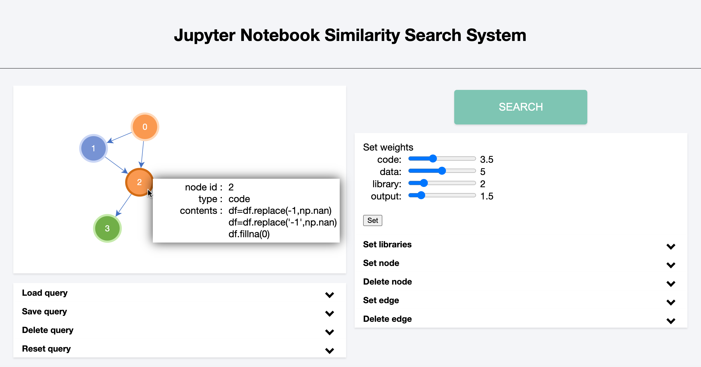

[日本語版](docs/README_Japanese.md)


# Similarity Search on Computational notebooks




## Demo

[Demo1](https://drive.google.com/file/d/1x1yiM8xQkwlJtQmQPgIOiSyN2d3QoUBu/view?usp=sharing)

[Demo2](https://drive.google.com/file/d/19CfahRTEwlbaOSZQLLfiALocrVQ3SNkH/view?usp=sharing)


## The components of our system

Our system uses PostgreSQL and Neo4j as DBMS. Our system also uses Jupyter Notebook to display the search results, and [Juneau](https://github.com/juneau-project/juneau.git) to transform computational notebooks into graphs and compute some similarities. 

Before searching, transformed computational notebooks must be stored into them.

## Preparation

Make a "similarity_retrieval_system" directory and clone our system into the directory.

Then clone [Juneau](https://github.com/juneau-project/juneau.git) into the same hierarchy to "similarity_retrieval_system" as following directory structure:

.

├── similarity_retrieval_system

│   ├── README.md

│   └── retrieval_system

│       ├── manage.py

│       ├──db.sqlite3

│       ├──interface

│       ├──retrieval_system

│       └──templates

└── juneau


## Start the web interface

Start PostgreSQL and Neo4J with the databases that have transformed computational notebooks.

Then start Jupyter Notebook on port 8888 by running the following command:

```
jupyter notebook --port 8888

```


To start the web interface, go to the "similarity_retrieval_system/retrieval_system" directory and run the following command:

```
python manage.py runserver
```

You can access the `localhost:8000` and you can use the interface.

If you want to change the server's port, this command starts the server on port 8080:
```
python manage.py runserver 8080
```
