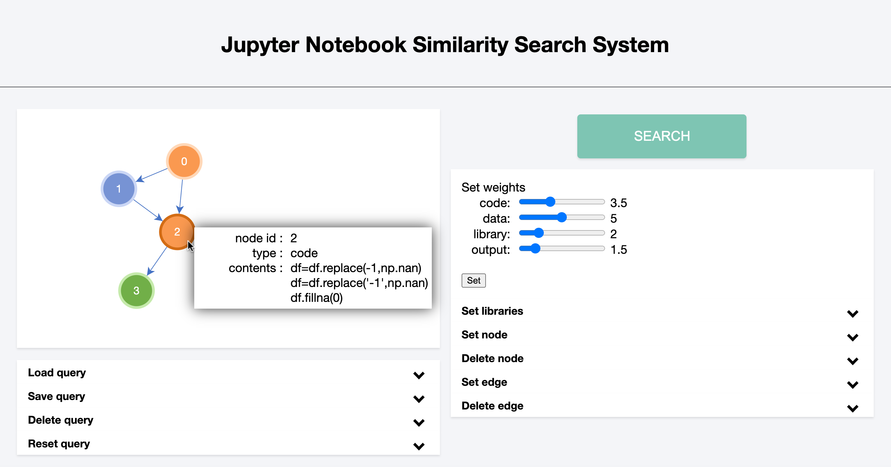

[English](./../README.md)

# 計算ノートブックの類似検索




## デモ

[Demo1](https://drive.google.com/file/d/1x1yiM8xQkwlJtQmQPgIOiSyN2d3QoUBu/view?usp=sharing)

[Demo2](https://drive.google.com/file/d/19CfahRTEwlbaOSZQLLfiALocrVQ3SNkH/view?usp=sharing)


## システムの構成要素

* DBMS: PostgreSQL, Neo4j, SQLite

* Jupyter Notebook

* [Juneau](https://github.com/juneau-project/juneau.git)

Juneauは計算ノートブックのグラフ化や類似度計算に利用しています．

## 準備

以下を実行し，本システムをクローンします．

```
git clone https://github.com/OnizukaLab/Similarity_Search_on_Computational_Notebooks.git
```

以下を実行し，ディレクトリSimilarity_Search_on_Computational_Notebooks/と同じ階層にJuneauをクローンします．

```
git clone https://github.com/juneau-project/juneau.git
```

主要なファイルで構成したファイルツリーを以下に示します．

.

├── Similarity_Search_on_Computational_Notebooks/

│   ├── README.md

│   ├── data.zip

│   ├── notebooks_data.zip

│   └── retrieval_system/

│       ├── manage.py

│       ├──interface/

│       └──retrieval_system/

├── juneau/

└── notebooks_data/

data.zipはNeo4Jのデータ，notebooks_data.zipは.ipynbフォーマットのファイルが入っています．

data.zipをNeo4Jのデータパスに解凍します．notebooks_data.zipは解凍し，ディレクトリnotebooks_data/をSimilarity_Search_on_Computational_Notebooks/と同じ階層に置きます．


## 検索Webアプリケーションの起動

あらかじめ，PostgreSQLとNeo4Jを起動しておきます．

また，以下のようにJupyter Notebookをポート8888で起動します．

```
jupyter notebook --port 8888
```

ディレクトリsimilarity_retrieval_system/retrieval_system/に移動し，以下のコマンドを実行してサーバを起動します．

```
python manage.py runserver <port>
```

http://127.0.0.1:<port>/interface/
でインタフェースにアクセスできます．

たとえばポートを8080にする場合は，

```
python manage.py runserver 8080
```

で起動し，
http://127.0.0.1:8080/interface/
にアクセスします．